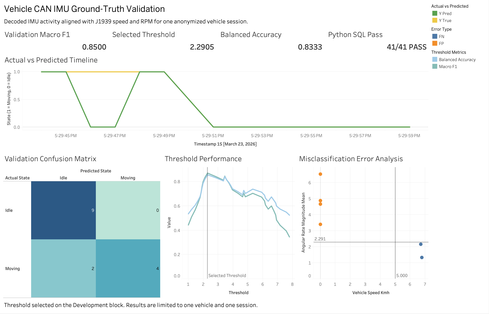
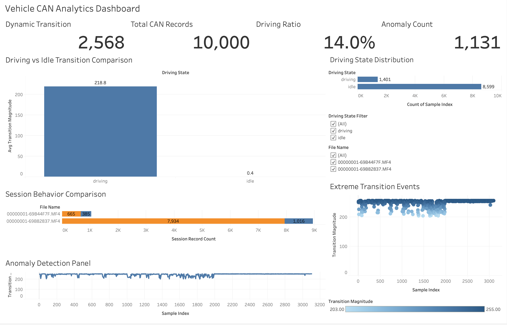

# Vehicle CAN Telemetry Analytics & IMU Ground-Truth Validation

## Project Overview

This project analyzes raw vehicle CAN telemetry from MF4 files through an end-to-end workflow using Python, AWS S3, Athena SQL, and Tableau.

The exploratory phase processed more than **1.9 million CAN records** and identified recurring transition patterns in CAN ID 111 Byte 4. Because the byte definition was undocumented, these patterns could not be treated as confirmed physical vehicle states.

I extended the project with chronological within-session validation using officially decoded IMU activity and ground-truth labels derived from J1939 Vehicle Speed and Engine RPM. The selected IMU threshold achieved a Validation Macro F1 of **0.8500** and Balanced Accuracy of **0.8333**. Python and Athena SQL results matched across all **41 validation checks**.

The validation was limited to one anonymized vehicle and one observed session. Therefore, IMU activity is presented as a vehicle-activity proxy rather than a definitive Moving/Idle signal.

## Final Validation Dashboard

The final Tableau dashboard combines threshold selection, validation metrics, actual-versus-predicted states, confusion-matrix results, and misclassification analysis.



Key dashboard metrics:

- **Selected Threshold:** 2.2905
- **Validation Macro F1:** 0.8500
- **Balanced Accuracy:** 0.8333
- **TP / TN / FP / FN:** 4 / 9 / 0 / 2
- **Python–SQL Comparison:** 41/41 checks passed

[View the Interactive Tableau Dashboard](TABLEAU_PUBLIC_URL)

## Problem Statement

Raw MF4 files contain large volumes of timestamped vehicle data, but many CAN IDs and byte values are undocumented. A byte may appear related to vehicle movement without representing a defined physical signal.

The project addressed two related problems:

- Build a scalable pipeline for processing more than 1.9 million raw CAN records.
- Test whether officially decoded IMU activity could represent vehicle activity when compared with Speed and RPM ground truth.

The objective was to measure the reliability, errors, and limitations of the IMU rule—not to claim a production-ready classifier.

## Dataset Scope

The exploratory and validation datasets served different purposes.

| Dataset                      | Purpose                               |                             Scope |
| ---------------------------- | ------------------------------------- | --------------------------------: |
| Full CAN Dataset             | Exploratory byte and session analysis |                 1.9M+ CAN records |
| IMU Validation Dataset       | Decoded IMU feature analysis          |            180 one-second windows |
| Ground-Truth Aligned Dataset | IMU, Speed, and RPM validation        |               147 aligned windows |
| Binary Evaluation Dataset    | Moving/Idle evaluation                |                       120 windows |
| Validation Identity          | Anonymized validation scope           | 1 vehicle, 1 session, 3 MF4 files |

The binary dataset contained **26 Moving** and **94 Idle** windows. Ambiguous and `engine_off_candidate` windows were excluded.

The full CAN dataset was used only for exploratory analysis. Ground-truth conclusions are based on the smaller aligned dataset and do not represent cross-vehicle validation.

## Tech Stack

- **Data Processing:** Python, pandas, NumPy, asammdf
- **Validation:** scikit-learn, Matplotlib
- **Cloud & SQL:** AWS S3, AWS Athena, SQL
- **Visualization & Tools:** Tableau, Jupyter Notebook, Git, GitHub

## Pipeline Architecture

```text
Raw MF4 CAN Data
→ Python MF4 Parsing
→ Exploratory CAN ID and Byte Analysis
→ Official IMU and J1939 Signal Decoding
→ One-Second Feature Engineering
→ Timestamp Alignment and Ground-Truth Labeling
→ Chronological Development/Validation Split
→ Threshold Selection and Error Analysis
→ AWS Athena SQL Cross-Validation
→ Tableau Dashboard
```

Raw MF4 files, device metadata, and actual vehicle identifiers were excluded from AWS outputs, Tableau Public, and GitHub.

## Methodology

### Phase 1 — Exploratory Byte 4 Analysis

MF4 files were parsed with Python and `asammdf`. CAN ID 111 was selected because its Byte 4 values showed repeated transition patterns across multiple files.

Transition magnitude was used to compare stable and dynamic sessions and identify candidate high-transition events. Because Byte 4 was undocumented, the results were treated as exploratory patterns rather than verified Moving/Idle states.



### Phase 2 — Official IMU Signal Decoding

The validation phase replaced the Byte 4 heuristic with officially decoded IMU and J1939 signals. IMU measurements were aggregated into one-second windows and aligned with Speed and RPM by UTC timestamp.

The primary vehicle-activity feature was:

```text
angular_rate_magnitude_mean
```

Ground-truth rules were defined independently:

- **Moving:** Speed ≥ 5 km/h and RPM ≥ 500
- **Idle:** Speed < 1 km/h and RPM ≥ 500
- **Ambiguous:** Speed between 1 and 5 km/h
- **Engine-Off Candidate:** RPM < 500

Only Moving and Idle windows were included in binary evaluation.

### Threshold Selection and Validation

The data was divided chronologically into Development and Validation blocks. Thirty-three threshold candidates were evaluated on the Development block, and the threshold with the highest Macro F1 was selected.

The threshold was frozen before the Validation results were reviewed. A separate 60-window Idle Stress Test measured false-positive behavior during sustained idle conditions.

Anonymized one-second datasets were also analyzed independently in Athena. Python and SQL results were then compared across data counts, threshold metrics, confusion-matrix values, and error-analysis outputs.

## Validation Results and Error Analysis

### Validation Results

| Metric             |     Development |    Validation |
| ------------------ | --------------: | ------------: |
| Evaluation Windows |              34 |            15 |
| Macro F1           |          0.8712 |        0.8500 |
| Balanced Accuracy  |          0.8571 |        0.8333 |
| TP / TN / FP / FN  | 20 / 10 / 4 / 0 | 4 / 9 / 0 / 2 |

Additional results:

- **Validation Accuracy:** 0.8667
- **Idle Stress Test:** 60/60 correctly classified
- **Idle Stress False Positive Rate:** 0.0000
- **Python–SQL Comparison:** 41/41 checks passed

### Error Analysis

The four Development false positives occurred when Speed indicated Idle but IMU activity exceeded the selected threshold. They were concentrated near low-speed transition windows and may reflect one-second boundary effects. The available data was not sufficient to assign a specific physical cause.

The two Validation false negatives occurred during smooth, low-speed movement. Speed met the Moving rule, but average IMU activity remained below the threshold.

Data-quality checks did not identify missing IMU, Speed, or RPM records as the primary cause. The errors instead demonstrate that some Moving and Idle conditions produce overlapping IMU activity.

## Key Findings, Limitations, and Future Improvements

### Key Findings

- Decoded IMU activity was generally higher during Moving windows.
- The selected threshold produced no false positives in the Validation block.
- All 60 Idle Stress Test windows were correctly classified.
- Python and Athena SQL produced consistent results.
- IMU activity is useful as an activity proxy but cannot independently confirm vehicle state.

### Limitations

- Validation covered only one vehicle and one session.
- The Validation block contained only 15 windows.
- A fully independent Test session was unavailable.
- Ignition data was unavailable, so Engine-Off remained a candidate state.
- The threshold should not be generalized across vehicles or device positions.

### Future Improvements

- Validate additional vehicles and independent sessions.
- Reserve a fully held-out session for final testing.
- Include Ignition and other decoded vehicle signals.
- Compare the threshold rule with supervised models after collecting more labeled data.

### Project Outcome

The project developed an end-to-end MF4-to-Tableau pipeline and strengthened the original exploratory analysis with documented ground-truth validation.

The main outcome was recognizing the limitation of the initial Byte 4 interpretation and replacing it with a measurable IMU-based activity proxy while clearly documenting its errors and limitations.

## Repository Structure and How to Run

### Repository Structure

```text
vehicle-can-analysis/
├── data/
├── src/                          # Python processing and validation
├── sql/
│   └── validation/               # Athena validation queries
├── notes/
│   └── validation/               # Findings and error analysis
├── outputs/
│   ├── validation/               # Metrics and predictions
│   ├── sql/validation/           # Athena outputs
│   ├── figures/                  # Validation figures
│   ├── tableau/                  # Tableau workbooks
│   └── screenshots/              # Dashboard images
├── requirements.txt
└── README.md
```

Raw MF4 files and identifying metadata are not included in the repository.

### How to Run

```bash
git clone https://github.com/skyyyyyy0/vehicle-can-analysis.git
cd vehicle-can-analysis

python -m venv venv
source venv/bin/activate
pip install -r requirements.txt
```

Run the main validation workflow:

```bash
python src/decode_imu_data.py
python src/prepare_ground_truth_data.py
python src/align_imu_ground_truth.py
python src/validate_imu_day1_dataset.py
python src/prepare_day2_analysis.py
python src/create_validation_split.py
python src/calculate_baseline_metrics.py
python src/compare_imu_thresholds.py
python src/analyze_threshold_sensitivity.py
python src/evaluate_within_session_validation.py
python src/evaluate_idle_stress_test.py
python src/prepare_athena_upload_data.py
```

Run the Athena SQL files in numerical order from `sql/validation/`, then compare the final results:

```bash
python src/compare_python_sql_metrics.py
```

The original MF4 extraction requires private source files, but the anonymized outputs allow the validation metrics, SQL comparisons, and Tableau dashboard to be reviewed.
